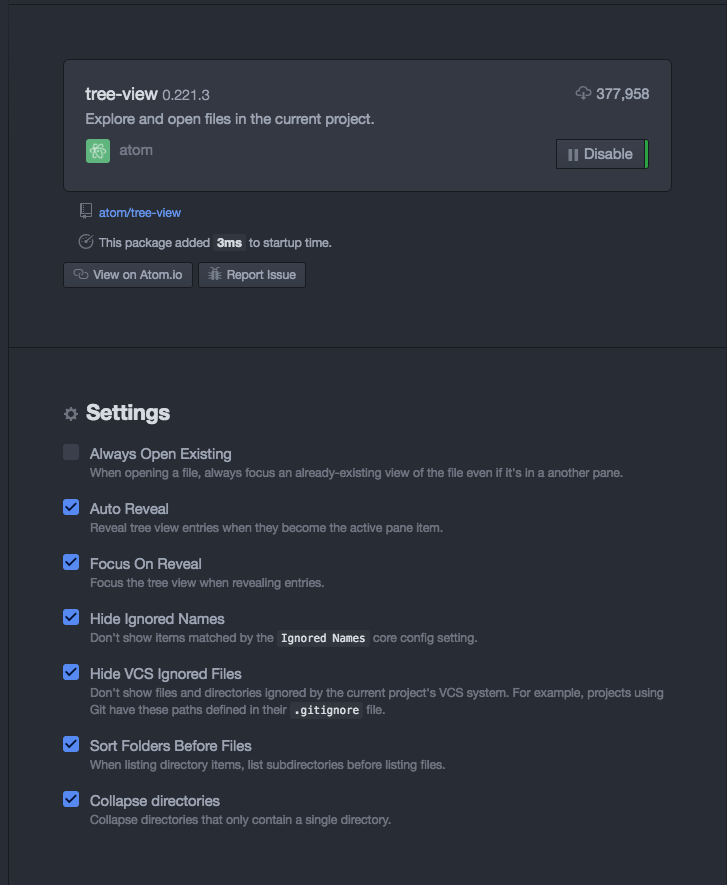

# Hide certain file types in Atom Tree-view

```
Atom > Preferences > Core > Ignored Names >
# only one line
.git, .hg, .svn, .DS_Store, ._*, Thumbs.db, desktop.ini, *.fits, *.zip, .ipynb_checkpoints,*.pdf, *.aux, *.fls, *.nav, *.out, *.toc, *.snm, *.fdb_latexmk
```

Then, go to Tree-view package  
Check on `Hide Ignored Names` and `Hide VCS Ignored Files`
.
