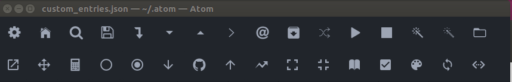

Adding toolbar to Atom editor
===============================

Install only two packages:
- toolbar
- toolbar-almighty  # in settings add custom_entries.json as custom settings file.

Then create `~/.Atom/custom_entries.json` and write your own toolbar entries.

## Available icons
To find the availabe icons go to this folder `~/.atom/packages/tool-bar/iconsets`.

we see 6 packages:
devicon, foundation, ionicons, font-awesome, icomoon, mdi

example:
iconicons/_ionicons-variables.less

## My toolbar icons
The snapshot of my toolbar icons is given below. 

Note that for the icons to work, we must install the related packages. Here, in this example I have installed
folowing community packages:  
- atom-shell-commands # for example to run mpiexec command
- script # to run any programs within atom
- markdown-preview-enhanced
- rst-preview-pandoc # to view rst files for sphinx
- advanced-open-file
- sequential-number
- minimap
- git plus
- clipboard-plus # to copy multiple items
- restart-atom
- open-terminal-here

Already built-in:
- application
- find-and-replace
- window
- editor
- pane
- bracket-matcher
- tree-view
- whitespace
- grammar-selector
- go-to-line
